# 2602-00994-gaia

Gaia formalization of Li et al. 2026 (arXiv:2602.00994): Reasoning and Tool-use Compete in Agentic RL -- LEAS diagnostic and DART training-time disentanglement.

<!-- badges:start -->
<!-- badges:end -->

## Overview

> [!TIP]
> **Reasoning graph information gain: `2.2 bits`**
>
> Total mutual information between leaf premises and exported conclusions — measures how much the reasoning structure reduces uncertainty about the results.

```mermaid
---
config:
  flowchart:
    rankSpacing: 80
    nodeSpacing: 30
---
graph TB
    claim_contribution_leas["★ Contribution 1: LEAS as quantitative interference diagnostic\n(0.50 → 0.76)"]:::exported
    claim_contribution_dart["★ Contribution 2: DART as gradient-isolated single model\n(0.50 → 0.81)"]:::exported
    claim_contribution_empirical["★ Contribution 3: 6.35%+ average EM improvement over baselines\n(0.50 → 0.76)"]:::exported
    claim_multi_lora_cannot_disentangle["Soft expert mixing in Multi-LoRA does not disentangle interference\n(0.88 → 0.88)"]:::premise
    claim_task_lora_too_coarse["Task-level LoRA selection still mixes reasoning and tool-use\n(0.92 → 0.92)"]:::premise
    claim_design_matrix_invertible["The six capability vectors are linearly independent\n(0.97 → 0.97)"]:::premise
    claim_hybrid_no_interaction["Hybrid composition induces no joint-parameter interaction\n(0.95 → 0.95)"]:::premise
    obs_lambda23_distribution["Empirical $\lambda_{23}^q$ histograms: interference dominates 3/4 settings\n(0.92 → 0.89)"]:::premise
    obs_arl_succeeds_in_interference_region["ARL succeeds in the interference region (Fig. 2 overlay)\n(0.85 → 0.80)"]:::premise
    claim_interference_dominates["★ LEAS finding: joint ARL induces systematic interference\n(0.50 → 0.72)"]:::exported
    obs_gradient_angles["Gradient angles: same-role aligned, different-role near-orthogonal\n(0.92 → 0.92)"]:::premise
    claim_gradient_conflict_explains_interference["★ Gradient compromise mechanism explains the interference\n(0.50 → 0.78)"]:::exported
    claim_dart_zero_interaction["DART structurally enforces $x_{23} = 0$ ($\lambda_{23} \equiv 0$)\n(0.97 → 0.97)"]:::premise
    claim_freeze_backbone_necessary["Backbone freezing is required for true disentanglement\n(0.95 → 0.95)"]:::premise
    claim_freeze_no_performance_loss["Backbone freezing does not sacrifice performance\n(0.85 → 0.85)"]:::premise
    claim_dart_solves_gradient_conflict["★ DART eliminates the gradient compromise underlying LEAS interference\n(0.50 → 0.82)"]:::exported
    table1_qwen3b["Table 1: Qwen2.5-3B EM scores across seven benchmarks\n(0.95 → 0.98)"]:::premise
    table2_qwen7b["Table 2: Qwen2.5-7B EM scores across seven benchmarks\n(0.95 → 0.98)"]:::premise
    obs_dart_beats_grpo_3b_inst["DART vs Search-R1-GRPO on Qwen2.5-3B-Instruct: +6.3 EM (avg)\n(0.50 → 1.00)"]:::premise
    obs_dart_beats_grpo_3b_base["DART vs Search-R1-GRPO on Qwen2.5-3B-Base: +10.2 EM (avg), +15.3 MH-Avg\n(0.50 → 1.00)"]:::premise
    obs_dart_beats_grpo_7b_inst["DART vs Search-R1-GRPO on Qwen2.5-7B-Instruct: +2.4 EM (avg)\n(0.50 → 1.00)"]:::premise
    obs_dart_beats_grpo_7b_base["DART vs Search-R1-GRPO on Qwen2.5-7B-Base: +6.6 EM (avg)\n(0.50 → 1.00)"]:::premise
    claim_dart_beats_grpo_universally["★ DART > Search-R1-GRPO is systematic across all four backbones\n(0.50 → 0.92)"]:::exported
    obs_dart_better_reasoning_3b["DART > Search-R1 under fixed retrieval, 3B-Base (NQ +17.5, HotpotQA +7.0)\n(0.93 → 0.93)"]:::premise
    obs_dart_better_reasoning_7b["DART > Search-R1 under fixed retrieval, 7B-Base (NQ +6.9, HotpotQA +5.1)\n(0.93 → 0.93)"]:::premise
    claim_joint_degrades_reasoning["★ Joint ARL training degrades reasoning quality (controlled for retrieval)\n(0.50 → 0.89)"]:::exported
    table3_hybrid["Table 3: DART (single-ability) vs hybrid inference\n(0.92 → 0.92)"]:::premise
    obs_lora_equals_searchr1["Vanilla LoRA performs equivalently to Search-R1\n(0.88 → 0.88)"]:::premise
    obs_2agent_strongest["2-Agent achieves the strongest results (upper bound for disentanglement)\n(0.93 → 0.93)"]:::premise
    obs_dart_approaches_2agent["DART approaches 2-Agent within ~1 EM, using a single backbone\n(0.93 → 0.93)"]:::premise
    claim_dart_efficient_disentanglement["★ DART obtains 2-Agent-like performance via training-time gradient isolation\n(0.50 → 0.77)"]:::exported
    obs_dart_retrieval_acc["DART > Search-R1 retrieval accuracy across all four (model, dataset) cells\n(0.93 → 0.93)"]:::premise
    claim_dart_improves_tool_use["★ DART improves tool-use capability as well as reasoning\n(0.50 → 0.92)"]:::exported
    claim_joint_training_helps_assumed["Implicit ARL assumption: joint training improves overall performance\n(0.55 → 0.16)"]:::premise
    contra_joint_vs_interference["contra_joint_vs_interference\n(0.95 → 1.00)"]:::premise
    strat_0(["infer\n0.02 bits"]):::weak
    claim_dart_beats_grpo_universally --> strat_0
    claim_dart_efficient_disentanglement --> strat_0
    claim_dart_improves_tool_use --> strat_0
    obs_dart_beats_grpo_3b_base --> strat_0
    obs_dart_beats_grpo_3b_inst --> strat_0
    obs_dart_beats_grpo_7b_base --> strat_0
    obs_dart_beats_grpo_7b_inst --> strat_0
    table1_qwen3b --> strat_0
    table2_qwen7b --> strat_0
    table3_hybrid --> strat_0
    strat_0 --> claim_contribution_empirical
    strat_1(["infer\n0.24 bits"]):::weak
    claim_dart_zero_interaction --> strat_1
    claim_freeze_backbone_necessary --> strat_1
    claim_freeze_no_performance_loss --> strat_1
    claim_multi_lora_cannot_disentangle --> strat_1
    claim_task_lora_too_coarse --> strat_1
    strat_1 --> claim_contribution_dart
    strat_2(["infer\n0.29 bits"]):::weak
    claim_dart_zero_interaction --> strat_2
    claim_freeze_backbone_necessary --> strat_2
    claim_gradient_conflict_explains_interference --> strat_2
    strat_2 --> claim_dart_solves_gradient_conflict
    strat_3(["infer\n0.19 bits"]):::weak
    claim_design_matrix_invertible --> strat_3
    claim_gradient_conflict_explains_interference --> strat_3
    claim_hybrid_no_interaction --> strat_3
    claim_interference_dominates --> strat_3
    strat_3 --> claim_contribution_leas
    strat_4(["infer\n0.19 bits"]):::weak
    claim_interference_dominates --> strat_4
    obs_2agent_strongest --> strat_4
    obs_dart_approaches_2agent --> strat_4
    obs_lora_equals_searchr1 --> strat_4
    strat_4 --> claim_dart_efficient_disentanglement
    strat_5(["infer\n0.29 bits"]):::weak
    claim_interference_dominates --> strat_5
    obs_gradient_angles --> strat_5
    strat_5 --> claim_gradient_conflict_explains_interference
    strat_6(["infer\n0.38 bits"]):::weak
    obs_arl_succeeds_in_interference_region --> strat_6
    obs_lambda23_distribution --> strat_6
    strat_6 --> claim_interference_dominates
    strat_7(["infer\n0.29 bits"]):::weak
    obs_dart_beats_grpo_3b_base --> strat_7
    obs_dart_beats_grpo_3b_inst --> strat_7
    obs_dart_beats_grpo_7b_base --> strat_7
    obs_dart_beats_grpo_7b_inst --> strat_7
    table1_qwen3b --> strat_7
    table2_qwen7b --> strat_7
    strat_7 --> claim_dart_beats_grpo_universally
    strat_8(["infer\n0.21 bits"]):::weak
    obs_dart_better_reasoning_3b --> strat_8
    obs_dart_better_reasoning_7b --> strat_8
    strat_8 --> claim_joint_degrades_reasoning
    strat_9(["infer\n0.14 bits"]):::weak
    obs_dart_retrieval_acc --> strat_9
    strat_9 --> claim_dart_improves_tool_use
    oper_0{{"⊗"}}:::contra
    claim_joint_training_helps_assumed --- oper_0
    claim_interference_dominates --- oper_0
    oper_0 --- contra_joint_vs_interference

    classDef premise fill:#ddeeff,stroke:#4488bb,color:#333
    classDef exported fill:#d4edda,stroke:#28a745,stroke-width:2px,color:#333
    classDef weak fill:#fff9c4,stroke:#f9a825,stroke-dasharray: 5 5,color:#333
    classDef contra fill:#ffebee,stroke:#c62828,color:#333
```

## Conclusions

| Label | Content | Prior | Belief |
|-------|---------|-------|--------|
| claim_contribution_dart | **Contribution 2 (DART).** The paper proposes **Disentangled Action-Reasoning... | 0.50 | 0.81 |
| claim_contribution_empirical | **Contribution 3 (empirical).** Across seven tool-augmented QA benchmarks (NQ... | 0.50 | 0.76 |
| claim_contribution_leas | **Contribution 1 (LEAS).** The paper introduces the **Linear Effect Attributi... | 0.50 | 0.76 |
| claim_dart_beats_grpo_universally | **Universal law (induction over four backbones).** DART's average EM exceeds ... | 0.50 | 0.92 |
| claim_dart_efficient_disentanglement | **Synthesis (Sec. 6.3 conclusion).** DART achieves near-2-Agent performance w... | 0.50 | 0.77 |
| claim_dart_improves_tool_use | **Synthesis (Appendix H).** DART improves not only reasoning (established by ... | 0.50 | 0.92 |
| claim_dart_solves_gradient_conflict | **Synthesis.** Because reasoning and tool-use gradients are routed to disjoin... | 0.50 | 0.82 |
| claim_gradient_conflict_explains_interference | **Mechanistic synthesis.** The near-orthogonality of reasoning vs tool-use gr... | 0.50 | 0.78 |
| claim_interference_dominates | **Synthesis.** Across NQ and HotpotQA on Qwen2.5-3B/7B, joint ARL training of... | 0.50 | 0.72 |
| claim_joint_degrades_reasoning | **Synthesis.** Because retrieval quality is held constant by the fixed-retrie... | 0.50 | 0.89 |

<!-- content:start -->
<!-- content:end -->
