# 2602-21204-gaia

Add your description here

<!-- badges:start -->
<!-- badges:end -->

## Overview

> [!TIP]
> **Reasoning graph information gain: `2.3 bits`**
>
> Total mutual information between leaf premises and exported conclusions — measures how much the reasoning structure reduces uncertainty about the results.

```mermaid
---
config:
  flowchart:
    rankSpacing: 80
    nodeSpacing: 30
---
graph TB
    claim_memorization_hypothesis["Memorization hypothesis: TTT-KVB stores KV associations and retrieves with $q$\n(0.55 → 0.98)"]:::premise
    claim_contribution_anomalies["★ Contribution 1: four empirical anomalies falsifying the memorization view\n(0.50 → 0.84)"]:::exported
    claim_contribution_equivalence["★ Contribution 2: TTT-KVB analytically equivalent to learned linear attention\n(0.50 → 0.97)"]:::exported
    claim_contribution_practical["★ Contribution 3: simplification, parallelization, and unification benefits\n(0.50 → 0.90)"]:::exported
    claim_deltanet_equals_linear_ttt["Prior result: DeltaNet = TTT with single linear layer + MSE\n(0.93 → 0.96)"]:::premise
    claim_prior_la_equivalence_restricted["Prior reduction holds only in the single-linear-layer / zero-init regime\n(0.95 → 0.97)"]:::premise
    claim_ttt_shares_la_compute_profile["All TTT-KVB variants share linear attention's compute profile (linear time, O(1) state)\n(0.95 → 0.97)"]:::premise
    obs_inner_loss_decreases_with_steps["Observation: inner-loop loss decreases monotonically with steps (1 -> 64)\n(0.93 → 0.89)"]:::premise
    obs_perf_degrades_with_more_steps["Observation: PSNR drops ~8 dB and perplexity rises ~0.4 as inner-steps increase\n(0.93 → 0.89)"]:::premise
    obs_grad_ascent_inner_loss_increases["Observation: gradient ascent demonstrably worsens inner-loop fit\n(0.97 → 0.95)"]:::premise
    obs_grad_ascent_table1["Observation (Table 1): gradient ascent matches or slightly beats baseline on 3 tasks\n(0.95 → 0.91)"]:::premise
    obs_qk_distributions_disjoint["Observation (Fig. 2): Q and K t-SNE distributions are visibly disjoint at every layer\n(0.92 → 0.88)"]:::premise
    obs_vo_distributions_also_disjoint["Observation (Fig. 2): V and O distributions are also disjoint\n(0.92 → 0.88)"]:::premise
    obs_q_replacement_table1["Observation (Table 1): replacing Q with K leaves performance essentially unchanged\n(0.95 → 0.92)"]:::premise
    claim_memorization_view_falsified["★ Summary: four anomalies jointly falsify the memorization view of TTT-KVB\n(0.50 → 0.71)"]:::exported
    claim_assumption_holds_for_studied_archs["The bias-free linear-final-layer assumption holds for LaCT, ViTTT, Titans\n(0.97 → 0.98)"]:::premise
    claim_ttt_is_linear_attention["★ TTT-with-KV-binding == learned linear attention (Theorems 5.1-5.3 jointly)\n(0.50 → 0.99)"]:::exported
    claim_anomalies_explained_by_la_view["★ Synthesis: linear-attention view simultaneously explains all four anomalies\n(0.50 → 0.99)"]:::exported
    obs_ablation_table2["Observation (Table 2): six-step ablation reduces TTT to standard LA\n(0.93 → 0.93)"]:::premise
    obs_variant1_best["Sub-observation: Variant 1 (update only last layer) is best on all three tasks\n(0.95 → 0.95)"]:::premise
    obs_variant6_minor_degradation["Sub-observation: Variant 6 (= standard LA) is within 0.4 / 0.2 / 0.2 of baseline\n(0.95 → 0.95)"]:::premise
    obs_remaining_components_marginal["Sub-observation: only deep MLP (NVS) and Muon (LLM) contribute non-trivially\n(0.88 → 0.88)"]:::premise
    claim_simplifications_preserve_performance["★ Synthesis: complex TTT design choices are redundant or marginal; LA reduction preserves perf\n(0.50 → 0.84)"]:::exported
    obs_parallel_throughput["Observation: parallel TTT layer is up to 4.0x faster than recurrent\n(0.95 → 0.95)"]:::premise
    obs_parallel_end_to_end_speedup["Observation: 1.19x end-to-end training speedup, comparable convergence (Fig. 4)\n(0.92 → 0.92)"]:::premise
    claim_parallel_form_speedup["★ Synthesis: exact, 4.0x TTT-layer-faster, 1.19x end-to-end-faster, quality-preserving parallel TTT\n(0.50 → 0.91)"]:::exported
    claim_anomalies_hold_lact_llm["Per-task observation: all four anomalies hold on LaCT-LLM\n(0.50 → 0.83)"]:::premise
    claim_anomalies_hold_lact_nvs["Per-task observation: all four anomalies hold on LaCT-NVS (Q-K mismatch directly visualized here)\n(0.50 → 0.84)"]:::premise
    claim_anomalies_hold_vittt["Per-task observation: anomalies 2 and 4 hold on ViTTT-B (Anomalies 1, 3 not separately tested)\n(0.50 → 0.80)"]:::premise
    claim_ablation_holds_lact_llm["Per-task ablation: LaCT-LLM degrades by only +0.4 perplexity across the full reduction\n(0.50 → 0.90)"]:::premise
    claim_ablation_holds_lact_nvs["Per-task ablation: LaCT-NVS degrades by only -0.2 dB PSNR across the full reduction\n(0.50 → 0.90)"]:::premise
    claim_ablation_holds_vittt["Per-task ablation: ViTTT-B Top-1 +0.2% across the full reduction (simplified beats baseline)\n(0.50 → 0.90)"]:::premise
    strat_0(["infer\n0.73 bits"]):::weak
    claim_ablation_holds_lact_llm --> strat_0
    claim_ablation_holds_lact_nvs --> strat_0
    claim_ablation_holds_vittt --> strat_0
    obs_ablation_table2 --> strat_0
    obs_remaining_components_marginal --> strat_0
    obs_variant1_best --> strat_0
    obs_variant6_minor_degradation --> strat_0
    strat_0 --> claim_simplifications_preserve_performance
    strat_1(["infer\n0.20 bits"]):::weak
    claim_anomalies_explained_by_la_view --> strat_1
    claim_ttt_is_linear_attention --> strat_1
    strat_1 --> claim_contribution_equivalence
    strat_2(["infer\n0.53 bits"]):::weak
    claim_anomalies_hold_lact_llm --> strat_2
    claim_anomalies_hold_lact_nvs --> strat_2
    claim_anomalies_hold_vittt --> strat_2
    obs_grad_ascent_inner_loss_increases --> strat_2
    obs_grad_ascent_table1 --> strat_2
    obs_inner_loss_decreases_with_steps --> strat_2
    obs_perf_degrades_with_more_steps --> strat_2
    obs_q_replacement_table1 --> strat_2
    obs_qk_distributions_disjoint --> strat_2
    obs_vo_distributions_also_disjoint --> strat_2
    strat_2 --> claim_memorization_view_falsified
    strat_3(["infer\n0.13 bits"]):::weak
    claim_assumption_holds_for_studied_archs --> strat_3
    claim_memorization_hypothesis --> strat_3
    claim_ttt_is_linear_attention --> strat_3
    strat_3 --> claim_anomalies_explained_by_la_view
    strat_4(["infer\n0.08 bits"]):::weak
    claim_assumption_holds_for_studied_archs --> strat_4
    claim_parallel_form_speedup --> strat_4
    claim_simplifications_preserve_performance --> strat_4
    strat_4 --> claim_contribution_practical
    strat_5(["infer\n0.20 bits"]):::weak
    claim_assumption_holds_for_studied_archs --> strat_5
    obs_parallel_end_to_end_speedup --> strat_5
    obs_parallel_throughput --> strat_5
    strat_5 --> claim_parallel_form_speedup
    strat_6(["infer\n0.12 bits"]):::weak
    claim_assumption_holds_for_studied_archs --> strat_6
    claim_deltanet_equals_linear_ttt --> strat_6
    claim_prior_la_equivalence_restricted --> strat_6
    claim_ttt_shares_la_compute_profile --> strat_6
    strat_6 --> claim_ttt_is_linear_attention
    strat_7(["infer\n0.30 bits"]):::weak
    claim_memorization_view_falsified --> strat_7
    strat_7 --> claim_contribution_anomalies

    classDef premise fill:#ddeeff,stroke:#4488bb,color:#333
    classDef exported fill:#d4edda,stroke:#28a745,stroke-width:2px,color:#333
    classDef weak fill:#fff9c4,stroke:#f9a825,stroke-dasharray: 5 5,color:#333
    classDef contra fill:#ffebee,stroke:#c62828,color:#333
```

## Conclusions

| Label | Content | Prior | Belief |
|-------|---------|-------|--------|
| claim_anomalies_explained_by_la_view | **Synthesis (Sec. 5.2).** Viewed through the lens of linear attention (@claim... | 0.50 | 0.99 |
| claim_contribution_anomalies | **Contribution 1 (Empirical anomalies).** The paper identifies four systemati... | 0.50 | 0.84 |
| claim_contribution_equivalence | **Contribution 2 (Theoretical equivalence).** The paper proves (Theorems 5.1-... | 0.50 | 0.97 |
| claim_contribution_practical | **Contribution 3 (Practical consequences).** Three concrete benefits follow f... | 0.50 | 0.90 |
| claim_memorization_view_falsified | **Summary of Section 4.** The four anomalies (@claim_anomaly_inner_vs_outer, ... | 0.50 | 0.71 |
| claim_parallel_form_speedup | **Synthesis (Sec. 6.2).** The fully parallel TTT formulation is (i) *exact* (... | 0.50 | 0.91 |
| claim_simplifications_preserve_performance | **Synthesis (Sec. 6.1).** The six-step ablation trajectory demonstrates that ... | 0.50 | 0.84 |
| claim_ttt_is_linear_attention | **Theoretical headline.** A broad class of TTT-with-KV-binding architectures ... | 0.50 | 0.99 |

<!-- content:start -->
<!-- content:end -->
