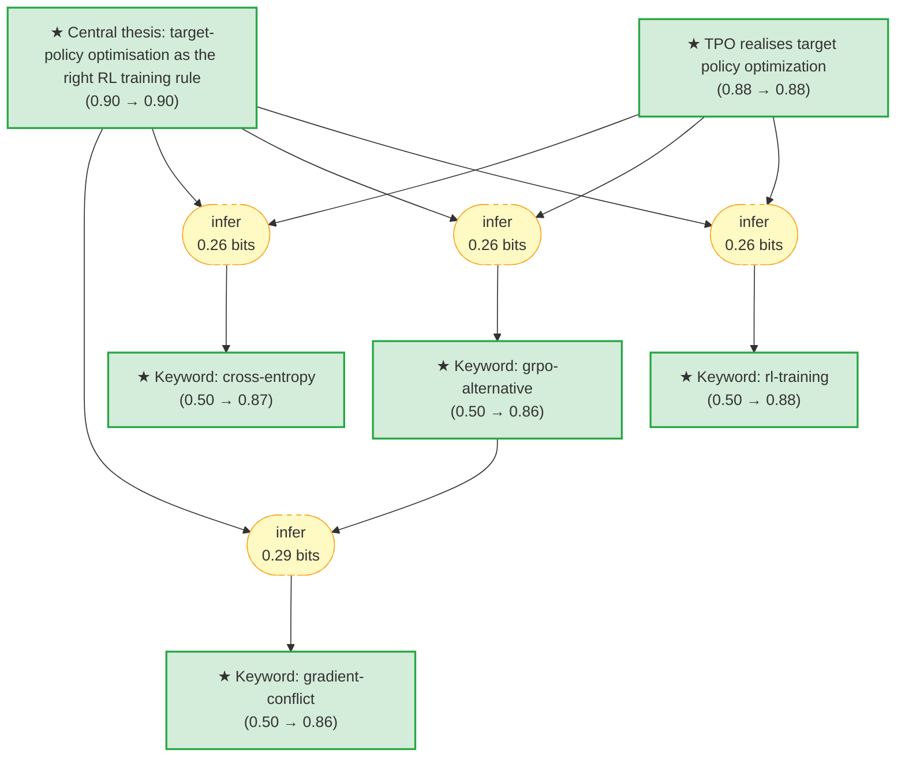

# 2604-06159-tpo-target-policy-optimization-gaia

Add your description here

<!-- badges:start -->
<!-- badges:end -->

## Overview

> [!TIP]
> **Reasoning graph information gain: `1.1 bits`**
>
> Total mutual information between leaf premises and exported conclusions — measures how much the reasoning structure reduces uncertainty about the results.

## Conclusions

| Label | Content | Prior | Belief |
|-------|---------|-------|--------|
| keyword_cross_entropy | The supervisory signal in TPO has the form of a **cross-entropy** term agains... | 0.50 | 0.87 |
| keyword_gradient_conflict | The failure mode of the GRPO baseline that TPO is designed to avoid is **grad... | 0.50 | 0.86 |
| keyword_grpo_alternative | TPO positions itself as a **GRPO alternative** -- a drop-in replacement for G... | 0.50 | 0.86 |
| keyword_rl_training | The work is situated within **RL training** of LLMs -- TPO is a training-time... | 0.50 | 0.88 |
| target_policy_is_the_optimisation_object | Policy-gradient RL fine-tuning of LLMs benefits from optimising the trainee p... | 0.90 | 0.90 |
| tpo_realises_target_policy_optimization | **TPO** -- the method named in the title -- is proposed as the concrete reali... | 0.88 | 0.88 |

<!-- content:start -->
<!-- content:end -->
